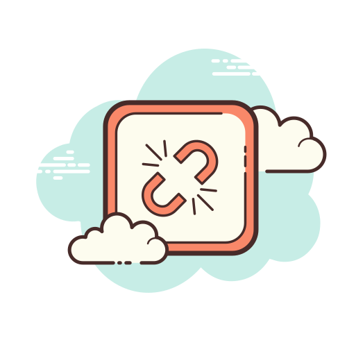

<div align="center">
    
    <h1>Slack Socket Mode</h1>
    <p>
        <b>Recieve events from Slack's <a href="https://api.slack.com/apis/connections/events-api">Events API</a> over a WebSocket connection. Deno port of <a href="https://www.npmjs.com/package/@slack/socket-mode">@slack/socket-mode</a></b>
    </p>
    <p>
        
        
        
        
        
        
    </p>
    <p>
        <b><a href="https://deno.land/x/slack_socket_mode">View on deno.land</a></b>
    </p>
    <br>
    <br>
    <br>
</div>

## Usage

```ts
import "https://deno.land/x/dotenv@v2.0.0/load.ts"
import { SocketModeClient } from "https://deno.land/x/slack_socket_mode@1.0.1/mod.ts"

const appToken = Deno.env.get("SLACK_APP_TOKEN")
const socketModeClient = new SocketModeClient({ appToken })

// Attach listeners to events by type. See: https://api.slack.com/events/message
socketModeClient.addEventListener("message", ({ detail: { body, ack } }) => {
    ack()
    console.log(body)
})

await socketModeClient.start()
```

## API

- API is similar to the [node @slack/socket-mode](https://www.npmjs.com/package/@slack/socket-mode), where `.addEventListener` is used instead of `.on` ([EventTarget docs](https://developer.mozilla.org/en-US/docs/Web/API/EventTarget))
- Complete [generated docs](https://doc.deno.land/https/deno.land/x/slack_socket_mode@1.0.1/mod.ts) are also available

## Supporters

[](https://github.com/khrj/slack-socket-mode/stargazers)

[](https://github.com/khrj/slack-socket-mode/network/members)

## Related

- [Deno Slack SDK](https://github.com/slack-deno/deno-slack-sdk)
- [Deno modules](https://github.com/khrj/deno-modules)
